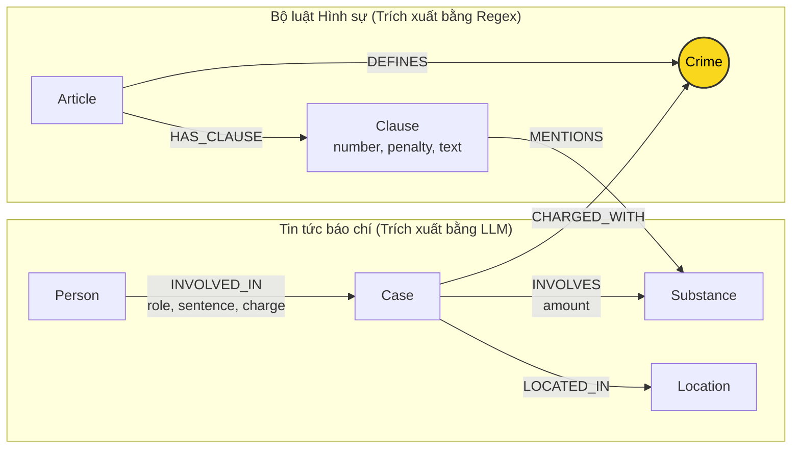

# Thiết kế Ontology — Day 19

**Họ tên:** Tạ Văn Tuấn  **MSSV:** 2A202602806

**Lựa chọn** (đánh dấu một):
- [x] Dùng ontology gợi ý (có thể chỉnh nhỏ)
- [ ] Tự thiết kế (xét bonus +15, xem `SUBMISSION.md`)

> Hướng dẫn: `LAB_GUIDE.md` Bước 2. Dùng ontology gợi ý thì vẫn phải điền đủ các mục dưới đây bằng lời của bạn.

## 1. Sơ đồ

Sơ đồ ontology thể hiện mối quan hệ giữa hai cơ sở tri thức (KB Luật và KB Tin tức). Node cầu nối trung tâm là `Crime` (màu vàng) cho phép liên kết vụ việc hình sự trong đời thực với chế tài xử phạt trong luật pháp:

## 2. Entity types (node labels)

| Label | Ý nghĩa | Khóa định danh (`MERGE` theo) | Properties | Lấy từ KB nào | Trích bằng (regex / LLM / khác) |
| --- | --- | --- | --- | --- | --- |
| `Article` | Đại diện cho một Điều luật trong BLHS hoặc văn bản quy phạm pháp luật ma túy | `id` (ví dụ: `"Điều 251 BLHS"`) | `id`, `title`, `law`, `doc_id` | Luật (`data/drug_law/`) | Regex (Metadata front matter + parsing tiêu đề Điều) |
| `Clause` | Đại diện cho một Khoản trong Điều luật, chứa tình tiết định khung và mức phạt | `id` (ví dụ: `"Điều 251 BLHS khoản 1"`) | `id`, `number`, `penalty`, `text`, `doc_id` | Luật (`data/drug_law/`) | Regex (Nhận diện số thứ tự khoản `^(\d+)\.\s` và regex tách khung hình phạt) |
| `Crime` | Tội danh pháp lý chuẩn. Đóng vai trò là **Node cầu nối** (Bridge node) xuyên suốt giữa 2 KB | `name` (tên tội chuẩn hóa chữ thường, ví dụ: `"mua bán trái phép chất ma túy"`) | `name` (không gán doc_id vì là shared node giữa nhiều tài liệu) | Cả hai KB (Luật và Tin tức) | Phía Luật: Regex từ tiêu đề Điều; Phía Tin: LLM extraction + chuẩn hóa bằng `link_entity` |
| `Case` | Vụ án / vụ việc ma túy cụ thể được đưa tin trên báo chí | `name` (tên ngắn của vụ án do LLM tóm lược hoặc lấy từ tiêu đề) | `name`, `summary`, `date`, `doc_id`, `source_title` | Tin tức (`data/drug_news/`) | LLM (`extract_news_cases` với cấu trúc JSON) |
| `Substance` | Tên chất ma túy hoặc tiền chất được quy định trong luật hoặc là tang vật trong vụ án | `name` (tên chuẩn hóa của chất, ví dụ: `"MDMA"`, `"Heroine"`, `"Ketamine"`, ...) | `name` (không gán doc_id vì là shared entity dùng chung) | Cả hai KB (Luật và Tin tức) | Phía Luật: `find_substances` quét từ điển chuẩn; Phía Tin: LLM trích xuất theo danh mục |
| `Person` | Cá nhân tham gia vụ việc (bị cáo, bị can, người liên quan, cầm đầu) | `name` (họ và tên đối tượng, ví dụ: `"Lê Minh Thành"`, `"Cái Quang Huy"`) | `name`, `aliases` (danh sách biệt danh / bí danh) | Tin tức (`data/drug_news/`) | LLM (`extract_news_cases`) |
| `Location` | Tỉnh / thành phố nơi xảy ra hành vi hoặc nơi Tòa án xét xử vụ án | `name` (tên địa phương, ví dụ: `"TP.HCM"`, `"Hà Nội"`, `"Nội Bài"`) | `name` (shared entity) | Tin tức (`data/drug_news/`) | LLM (`extract_news_cases`) |

## 3. Relationships

| Type | Từ → Đến | Properties trên cạnh | Ý nghĩa |
| --- | --- | --- | --- |
| `DEFINES` | `(:Article) → (:Crime)` | *(không có)* | Điều luật quy định, xác lập cấu thành tội phạm và hình phạt cho tội danh tương ứng. |
| `HAS_CLAUSE` | `(:Article) → (:Clause)` | *(không có)* | Điều luật bao gồm các khoản quy định các khung hình phạt chi tiết theo mức độ nghiêm trọng hoặc khối lượng tang vật. |
| `MENTIONS` | `(:Clause) → (:Substance)` | *(không có)* | Khoản luật viện dẫn chất ma túy cụ thể để xác định cấu thành hoặc khung hình phạt theo định lượng chất đó. |
| `CHARGED_WITH` | `(:Case) → (:Crime)` | *(không có)* | Vụ án bị khởi tố, truy tố hoặc xét xử về tội danh pháp lý này (cạnh đi vào Node cầu nối `Crime`). |
| `INVOLVES` | `(:Case) → (:Substance)` | `amount` (khối lượng tang vật thu giữ, ví dụ: `"hơn 9,6kg"`, `"khoảng 406g"`) | Vụ việc có liên quan hoặc thu giữ loại chất ma túy kèm khối lượng cụ thể. |
| `LOCATED_IN` | `(:Case) → (:Location)` | *(không có)* | Địa bàn xảy ra vụ việc hoặc địa điểm diễn ra phiên tòa xét xử. |
| `INVOLVED_IN` | `(:Person) → (:Case)` | `role` (vai trò: bị cáo, bị can, người liên quan), `charge` (tội danh của cá nhân), `sentence` (mức án tuyên: ví dụ `"36 tháng tù"`, `"tử hình"`) | Cá nhân tham gia vào vụ án cụ thể với vai trò, tội danh và mức án xác định. |

## 4. Node cầu nối giữa 2 KB

- **Node nào:** `Crime` (Tội danh ma túy, ví dụ: `"mua bán trái phép chất ma túy"`, `"vận chuyển trái phép chất ma túy"`, `"tổ chức sử dụng trái phép chất ma túy"`).
- **Vì sao chọn node này:**
  - Tin tức báo chí phản ánh các vụ án đời thực gắn liền với các đối tượng bị khởi tố/xét xử theo tội danh cụ thể (`(Case)-[:CHARGED_WITH]->(Crime)`).
  - Bộ luật Hình sự phân định cấu trúc pháp lý và khung hình phạt theo từng tội danh ở từng Điều luật cụ thể (`(Article)-[:DEFINES]->(Crime)`).
  - Do đó, `Crime` là khái niệm trung gian lý tưởng nhất kết nối giữa thế giới thực tiễn tố tụng (Tin tức) và quy phạm pháp luật (Luật), cho phép đi từ một cá nhân/vụ án sang điều luật, khung hình phạt tương ứng mà không cần bài báo phải trích dẫn chính xác số Điều luật.
- **Cách đảm bảo hai phía khớp tên:**
  - **Phía Luật:** Tên tội danh được lấy tự động từ tiêu đề Điều luật thông qua hàm `normalize_crime` (loại bỏ tiền tố `"Tội "`, chuyển thành chữ thường, xóa khoảng trắng thừa và dấu ngoặc kép) để tạo danh mục tội danh chuẩn (`known_crimes`).
  - **Phía Tin tức:**
    1. Khi gọi LLM trích xuất tin tức (`extract_news_cases`), ta cung cấp danh sách tên chuẩn: `DANH SÁCH TỘI DANH: {crimes}` và yêu cầu LLM bắt buộc chọn đúng nguyên văn từ danh sách.
    2. Sau khi LLM trả về, hệ thống chạy hàm `link_entity(name, known_crimes)`:
       - Chuẩn hóa chuỗi bằng `normalize_crime`.
       - Thực hiện kiểm tra khớp chính xác (Exact match).
       - Nếu không khớp chính xác, áp dụng thuật toán so khớp mờ `difflib.get_close_matches(cutoff=0.8, n=1)` để bắt các biến thể gõ dấu tiếng Việt phổ biến của báo chí (ví dụ: `"ma tuý"` vs `"ma túy"`, bỏ sót ký tự nhỏ).
       - Trả về đúng chuỗi gốc (original canonical name) trong danh sách luật để khi chạy `MERGE (c:Crime {name: crime})`, cả hai phía đều hội tụ về đúng một node `Crime` duy nhất trên đồ thị.
- **Khi nào cầu gãy, và bạn xử lý thế nào:**
  - **Trường hợp cầu gãy:**
    1. Bài báo sử dụng cách diễn đạt dân dã, tiếng lóng thay vì tội danh pháp lý (ví dụ: *"ôm hàng trắng"*, *"bảo kê bay lắc"*) và LLM không suy luận ra tội danh chuẩn.
    2. Tội danh trong bài báo thuộc về một Điều luật không nằm trong tập dữ liệu (corpus hiện tại chỉ gồm Chương XX BLHS về tội phạm ma túy).
    3. Biến thể chính tả quá khác biệt khiến thuật toán fuzzy matching với ngưỡng an toàn `cutoff=0.8` từ chối liên kết.
  - **Cách xử lý:**
    - Tuyệt đối không hạ cutoff xuống quá thấp để tránh "nối ẩu" (nối sai tội danh còn nguy hiểm hơn không nối).
    - Áp dụng kiến trúc Hybrid RAG: GraphRAG kết hợp cả vector chunks retrieval và graph facts. Khi cầu nối gãy, các đoạn văn bản (chunks) thu được từ vector search vẫn cung cấp ngữ cảnh bài báo gốc cho LLM, tránh tình trạng mất trắng thông tin.

## 5. Competency questions

Dưới đây là các đường đi trên đồ thị (Cypher pattern) tương ứng với 6 câu hỏi đánh giá trong `data/benchmark_kg.json`:

| Câu | Đường đi (Cypher pattern) | Trả lời được? |
| --- | --- | --- |
| Q1 | `(:Article {law: 'Luật Phòng, chống ma túy 2021'})-[:HAS_CLAUSE]->(cl:Clause)` | **Có**. Vector retrieval tìm đúng Điều 2 Luật PCMT 2021, graph facts mở rộng các khoản giải thích thuật ngữ ("tiền chất là hóa chất không thể thiếu..."). |
| Q2 | `(p:Person)-[:INVOLVED_IN {sentence: 'tử hình'}]->(k:Case)-[:LOCATED_IN]->(l:Location)` | **Có**. Vector search tìm vụ án 36kg ma túy, graph trích xuất các bị cáo có thuộc tính `sentence: 'tử hình'` gắn trên cạnh `INVOLVED_IN` (Trần Thanh Tuấn, Trần Minh Tâm). |
| Q3 | `(:Person {name: 'Lê Minh Thành'})-[:INVOLVED_IN {sentence: '36 tháng tù'}]->(k:Case)-[:CHARGED_WITH]->(c:Crime)<-[:DEFINES]-(a:Article {id: 'Điều 251 BLHS'})-[:HAS_CLAUSE]->(cl:Clause {number: 1})` | **Có (Rất tốt)**. Graph đi từ Person Lê Minh Thành → Case → Crime ("mua bán trái phép chất ma túy") → Article Điều 251 BLHS → Clause khoản 1 (phạt tù 02 năm đến 07 năm). |
| Q4 | `(:Person)-[:INVOLVED_IN]->(k:Case)-[:CHARGED_WITH]->(c:Crime)<-[:DEFINES]-(a:Article {id: 'Điều 255 BLHS'})-[:HAS_CLAUSE]->(cl:Clause)` | **Có**. Từ Person có alias "Hoàng Nato" → Case → Crime ("tổ chức sử dụng trái phép chất ma túy") → Article Điều 255 BLHS → các Clause (khoản 4 tù 20 năm hoặc chung thân). |
| Q5 | `(:Person {name: 'Cái Quang Huy'})-[:INVOLVED_IN]->(k:Case)-[:CHARGED_WITH]->(c:Crime)<-[:DEFINES]-(a:Article {id: 'Điều 250 BLHS'})-[:HAS_CLAUSE]->(cl:Clause {number: 4})-[:MENTIONS]->(s:Substance {name: 'MDMA'})` đồng thời `(k)-[:INVOLVES {amount: 'hơn 9,6kg'}]->(s)` | **Có (Rất tốt)**. Graph liên kết Case Cái Quang Huy với chất MDMA và tội vận chuyển (Điều 250), lọc ra đúng Clause 4 (có nhắc đến MDMA với định lượng trên 100g) quy định khung hình phạt tử hình. |
| Q6 | `(k:Case)-[:INVOLVES]->(s:Substance {name: 'MDMA'})` cùng `(p:Person)-[:INVOLVED_IN]->(k)` | **Có**. Graph tập hợp tất cả các Case có cạnh `INVOLVES` nối tới node `Substance {name: 'MDMA'}` (vụ Cái Quang Huy, vụ Lê Minh Thành, vụ Pháp y tâm thần Trung ương) cùng nhân vật liên quan. |

## 6. Quyết định thiết kế và đánh đổi

1. **Quyết định 1: Dùng node trung gian `Crime` làm cầu nối thay vì liên kết trực tiếp `Case` sang `Article`**
   - *Đã chọn:* `(Case)-[:CHARGED_WITH]->(Crime)<-[:DEFINES]-(Article)`.
   - *Phương án khác:* Nối trực tiếp `(Case)-[:ACCORDING_TO]->(Article)`.
   - *Vì sao chọn:* Tin tức báo chí hiếm khi nêu chính xác mã điều luật hoặc có bài chỉ viết tên tội danh thông thường; trong khi đó tên tội danh là khái niệm pháp lý phổ quát có thể chuẩn hóa được. Tách node `Crime` giúp đồ thị linh hoạt, cho phép nhiều vụ án và nhiều điều luật cùng quy tụ về các tội danh chuẩn mà không bị phụ thuộc vào việc nhà báo có nhớ ghi số Điều hay không.
   - *Đánh đổi:* Đồ thị cần thêm 1 bước nhảy (hop) khi truy vấn (`Case → Crime → Article`) và phụ thuộc vào chất lượng hàm chuẩn hóa `link_entity`.

2. **Quyết định 2: Tách cấu trúc Điều luật thành các node `Clause` độc lập và gắn quan hệ `MENTIONS` tới `Substance`**
   - *Đã chọn:* Mô hình hóa mỗi khoản thành một node `Clause` riêng biệt (`Article -[:HAS_CLAUSE]-> Clause`) và gắn quan hệ `Clause -[:MENTIONS]-> Substance`.
   - *Phương án khác:* Chỉ tạo 1 node `Article` duy nhất và gộp toàn bộ nội dung các khoản vào thuộc tính văn bản của Article.
   - *Vì sao chọn:* Trong Bộ luật Hình sự, mỗi khoản có mức án phạt và định lượng tang vật rất khác nhau (ví dụ: khoản 1 phạt 2-7 năm tù, khoản 4 phạt tù 20 năm, chung thân hoặc tử hình). Tách tới cấp `Clause` cho phép thuật toán Graph traversal chọn lọc chính xác khung hình phạt liên quan đến vụ án (thông qua điều kiện lọc khoản 1 hoặc khoản có chứa chất mà vụ án thu giữ), tránh việc nhồi nhét hàng nghìn token của toàn bộ Điều luật vào prompt gây loãng context và tốn chi phí token.
   - *Đánh đổi:* Số lượng node và quan hệ trong cơ sở dữ liệu tăng lên đáng kể (18 Điều luật sinh ra 99 Clause và hàng trăm cạnh quan hệ), làm tăng nhẹ thời gian và tài nguyên xây dựng đồ thị ban đầu.

3. **Quyết định 3: Lưu trữ mức án (`sentence`), tội danh cá nhân (`charge`) và vai trò (`role`) trên thuộc tính cạnh `INVOLVED_IN`**
   - *Đã chọn:* `(:Person)-[:INVOLVED_IN {role, charge, sentence}]->(:Case)`.
   - *Phương án khác:* Lưu `sentence` trực tiếp vào thuộc tính của node `Person` (`Person.sentence = '36 tháng tù'`) hoặc tách riêng node `(:Sentence)`.
   - *Vì sao chọn:* Trong tố tụng hình sự, một vụ án có nhiều bị cáo với mức án khác nhau, và một cá nhân có thể liên quan đến nhiều vụ việc trong các thời điểm khác nhau. Thuộc tính mức án và vai trò là tính chất của mối quan hệ giữa cá nhân đó trong khuôn khổ vụ án cụ thể đó. Gắn vào cạnh `INVOLVED_IN` thể hiện chính xác mô hình thế giới thực và ngăn ngừa xung đột dữ liệu khi MERGE các node Person.
   - *Đánh đổi:* Để trích xuất mức án của một người, Cypher bắt buộc phải duyệt qua thuộc tính quan hệ thay vì chỉ đọc trực tiếp thuộc tính từ node đỉnh.

## 7. So với ontology gợi ý (bắt buộc nếu xét bonus)

Bài nộp sử dụng ontology gợi ý chuẩn của repository nhằm đảm bảo tính ổn định tối đa của hệ thống, tương thích hoàn toàn với bộ test và benchmark chuẩn. Không đăng ký xét bonus +15.

| Điểm khác | Gợi ý làm gì | Bạn làm gì | Vấn đề nó giải quyết | Bằng chứng (Cypher, hoặc số liệu benchmark) |
| --- | --- | --- | --- | --- |
| *(Không áp dụng)* | Sử dụng ontology gợi ý chuẩn | Giữ nguyên ontology gợi ý chuẩn | Đảm bảo tính ổn định và tuân thủ contract | Đạt 48/48 unit tests và 7/7 check contract |

## 8. Hạn chế còn lại

1. **Vấn đề trùng thực thể (Entity Duplication / Resolution):** Khóa định danh của `Case`, `Person` và `Location` dựa vào tên tự do do LLM trích xuất. Nếu hai bài báo viết về cùng một đối tượng nhưng sử dụng cách xưng hô khác nhau (ví dụ: *"Lê Minh Thành"* vs *"bị cáo Thành"*, hoặc *"Dương Minh Tuấn"* vs *"Hoàng Nato"* khi chưa có trường alias), đồ thị sẽ sinh ra hai node Person riêng biệt thay vì gộp làm một.
2. **Chưa mô hình hóa ngưỡng số học của tang vật (Numerical Thresholds):** Quan hệ `(Clause)-[:MENTIONS]->(Substance)` chỉ ghi nhận sự xuất hiện của chất trong điều khoản luật, chưa trích xuất được ngưỡng định lượng số (ví dụ: *"từ 100 gam trở lên"*). Việc ánh xạ khối lượng tang vật thực tế (ví dụ: 9,6kg) vào khung hình phạt khoản 4 vẫn phải phụ thuộc vào khả năng lập luận số học của LLM trên dữ kiện văn bản của Clause.
3. **Từ đồng nghĩa của chất ma túy (Substance Aliasing):** Chưa có bảng từ điển đồng nghĩa để ánh xạ các tên gọi lóng thường gặp trên báo chí (như *"thuốc lắc"* ↔ *"MDMA"*, *"hàng đá"* ↔ *"Methamphetamine"*, *"cỏ Mỹ"* ↔ chất hướng thần) về tên danh mục hóa học chuẩn trong luật pháp.
